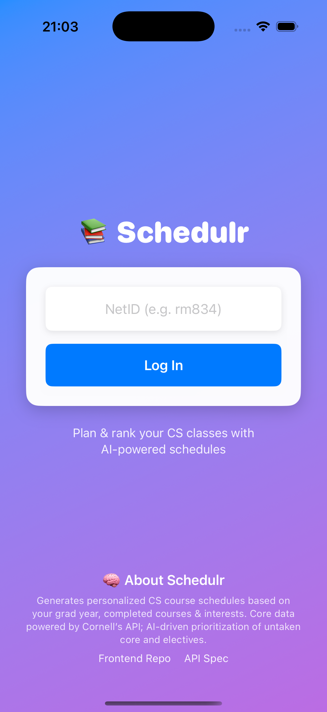
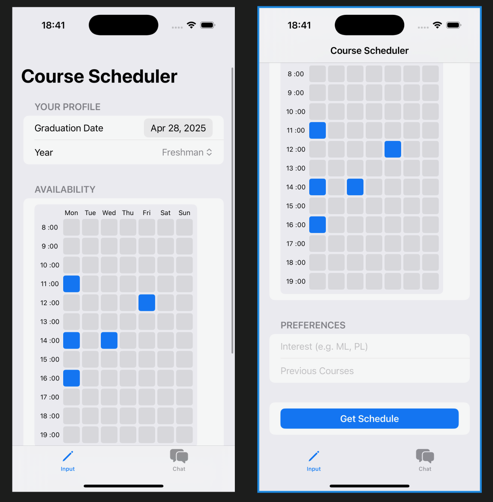

# 📚 Schedulr

### *A course planning tool that ranks CS classes and gives you potential schedules based on your interests using AI.*

---

## 🔗 Repositories

- **Back Repo:** [CourseApp](https://github.com/Robylongo/CourseApp)

---

## 🖼️ Screenshots

### Homepage

  

### Feature Highlights

  

---

## 🧠 About the App

**Schedulr** generates a personalized schedule of CS classes based on your graduation year, completed courses, and academic interests. It prioritizes untaken core courses while also considering electives that match your interests.  
Course data is sourced from the FA24 Cornell course API, as the FA25 data lacks key fields required for database storage.

---

## ✅ How We Meet Backend Requirements

- **17 API routes** using `GET`, `POST`, `PATCH`, and `DELETE` to support full CRUD functionality.
- **8 database tables**, with **7 related** through foreign keys and relationships.
- **API specification available in** `api_spec.md`.

---

Feel free to clone the repo and explore the backend logic powering the AI-based course planner!
